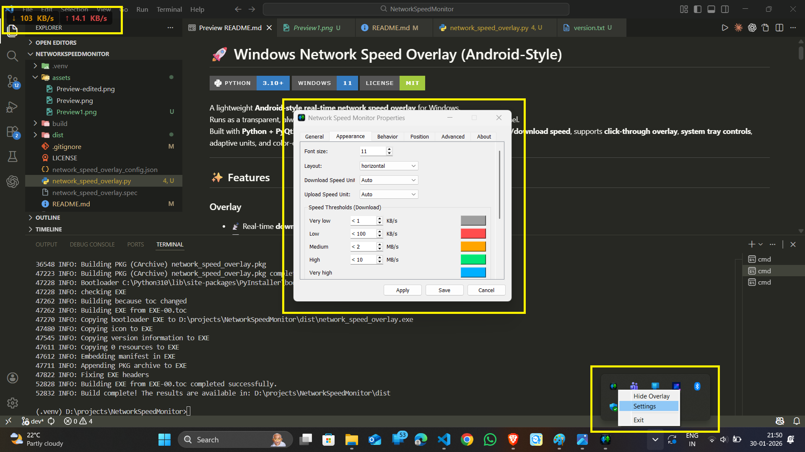

# 🚀 Windows Network Speed Overlay (Android-Style)


[](https://github.com/MayurVadhadiya360/Windows-Network-Speed-Monitor/blob/main/LICENSE)

A lightweight **Android-style real-time network speed overlay** for Windows.  
Runs as a transparent, always-on-top widget with full customization via a built-in settings panel.  
Built with **Python + PyQt5**, using **psutil** and the Windows Win32 API., it displays **live upload/download speed**, supports **click-through overlay**, **system tray controls**, adaptive units, and color-coded speed thresholds.

---

## ✨ Features

### Overlay
- 📡 Real-time **download & upload speed**
- 🪟 Frameless **always-on-top transparent overlay**
- 🖱 **Click-through mode** (mouse passes through)
- ↕ Separate **download / upload** indicators
- 🔢 Android-style **3-digit adaptive formatting**
- 📏 Automatic unit switching (B/s → KB/s → MB/s → GB/s)

### Appearance
- Font size control
- Horizontal / vertical layout
- Independent unit mode for upload & download
- Color-coded speed thresholds
- Custom colors per speed range

### Behavior
- Click-through toggle  
- Always-on-top toggle  
- Refresh interval (250–5000 ms)  
- Pause updates when hidden  

### Position
- Manual X/Y placement  
- Quick presets (corners, center)  
- Position restore on cancel  

### System Tray
- Show / Hide overlay  
- Open Settings (double-click tray icon)  
- Exit app safely  

### Startup
- Optional **Start with Windows**
- Uses Windows Startup folder shortcut 

---

## 📸 Preview

<!-- ↓ 12.3 MB/s ↑ 1.2 MB/s -->
#### Network Speed Display Preview


---

## 🛠 Tech Stack

- **Python 3.9+**
- **PyQt5** – UI & overlay
- **psutil** – network counters
- **win32gui / win32con** – click-through & window styles
- **winshell + WScript** – Windows startup integration

---

## 📦 Installation

### 1️⃣ Clone the repository
```bash
git clone https://github.com/MayurVadhadiya360/Windows-Network-Speed-Monitor.git
cd Windows-Network-Speed-Monitor
```

### 2️⃣ Install dependencies
```bash
pip install - r requirements.txt
```
Note: Use official python (Using with Anaconda environment may result in `_ctypes ` error)

### 3️⃣ Run the app
```bash
python netspeed_overlay.py
```
⚠ Windows only (Win32 APIs are required)

## 🎮 Usage

- App starts minimized to tray
- Overlay appears immediately
- Double-click tray icon → Settings
- Right-click tray → menu

---

## 🎨 Speed Threshold System
Each direction (download/upload) supports:
|Level	    | Default       |
| --------- | ------------- |
|Very Low	  | < 1 KB/s      |
|Low	      | < 100 KB/s    |
|Medium	    | < 2 MB/s      |
|High	      | < 10 MB/s     |
|Very High	| fallback color|

Thresholds & colors are fully configurable.

## 🔢 Speed Formatting Logic

| Speed     | Output      |
| --------- | ----------- |
| 512 B/s   | `512 B/s`   |
| 1.2 KB/s  | `1.2 KB/s`  |
| 12.3 MB/s | `12.3 MB/s` |
| 1.0 GB/s  | `1 GB/s`    |

Max 3 visible digits

## 🧠 How Click-Through Works

The overlay uses Win32 extended styles:
- `WS_EX_LAYERED`
- `WS_EX_TRANSPARENT`

This allows the window to:
- Stay visible
- Not block mouse input
- Work in fullscreen apps


## 🏁 Start with Windows
Enabled from **Settings → General**  
Creates a shortcut in:
```makefile
shell:startup
```


## 📦 Build EXE (PyInstaller)
```bash
pyinstaller --onefile --noconsole ^
  --icon=up_down_icon.ico ^
  --add-data "up_down_icon.ico;." ^
  --add-data "network_speed_overlay_config.json;." ^
  --version-file version.txt ^
  network_speed_overlay.py
```
The EXE will be created in the `dist/` folder.
```bash
dist/network_speed_overlay.exe
```

## ⚠ Limitations
- Windows-only (uses Win32 API)
- Requires admin rights on some systems
- Click-through may not work over all fullscreen apps

## 🧠 Future Improvements
- Multi-monitor positioning
- Export / Import settings
- Per-network-adapter selection
- Theme presets
- CPU usage limiter
- Rolling average smoothing
- PyQt6 migration

## 📜 License
MIT License — free to use, modify, and distribute.

## 🙌 Author
**Mayur Vadhadiya**  
GitHub: [https://github.com/MayurVadhadiya360](https://github.com/MayurVadhadiya360)
